# Delivery Management System - Architecture Diagram

## Current Architecture

```mermaid
graph TB
    subgraph "User Interface Layer"
        UI[Streamlit Web Interface<br/>📱 Chat Frontend<br/>📤 Document Upload]
        Admin[Admin Interface<br/>⚙️ Configuration<br/>🗑️ Collection Management]
    end
    
    subgraph "Application Layer - Current"
        UploadHandler[Document Upload Handler<br/>📄 Multi-format Support]
        SearchHandler[Search Handler<br/>🔍 Query Processing]
        AuthHandler[Authentication Handler<br/>🔐 SharePoint SSO/OAuth2]
    end
    
    subgraph "Processing Layer - Current"
        Parser[Document Parser<br/>PDF, Word, PPT, TXT]
        Chunker[Text Chunker<br/>Size: 500, Overlap: 100]
        Embedder[Sentence Transformer<br/>all-MiniLM-L6-v2]
    end
    
    subgraph "AI/LLM Layer - Current"
        LLM[Groq LLM<br/>gpt-oss-20b<br/>Answer Generation]
    end
    
    subgraph "Data Storage Layer - Current"
        VectorDB[(Qdrant Vector Store<br/>📊 Embeddings & Chunks)]
    end
    
    subgraph "External Services - Current"
        SharePoint[SharePoint Online<br/>🔗 Document Source]
        GroqAPI[Groq API<br/>🤖 LLM Service]
    end
    
    subgraph "Future Components - Planned"
        PlannerAgent[Planner Agent<br/>🎯 Orchestrator<br/>Route queries]
        DisambiguationAgent[Disambiguation Agent<br/>❓ Intent Clarification]
        RAGAgent[RAG Agent<br/>📚 Retrieval Specialist]
        SQLAgent[SQL Query Generator Agent<br/>💾 Database Queries]
        ResponseCompiler[Response Compiler Agent<br/>✍️ Response Synthesis]
        Langfuse[Langfuse<br/>📝 Prompt Management<br/>& Versioning]
        SQLExecutor[SQL Query Executor<br/>🗄️ Database Access]
        StructuredDB[(Structured Database<br/>📋 Metadata & Relations)]
        MultiModalParser[Multi-modal Parser<br/>🖼️ Images, Tables, Charts]
        AdvancedChunker[Advanced Chunker<br/>🧠 Semantic Chunking]
    end
    
    %% User Interactions
    UI -->|/chat| SearchHandler
    UI -->|/upload| UploadHandler
    Admin -->|/config| UploadHandler
    
    %% Current Flow - Upload
    UploadHandler -->|File/URL| AuthHandler
    AuthHandler -->|Authenticated| SharePoint
    AuthHandler -->|Download| Parser
    Parser -->|Extracted Text| Chunker
    Chunker -->|Text Chunks| Embedder
    Embedder -->|Vectors| VectorDB
    
    %% Current Flow - Search
    SearchHandler -->|Query| Embedder
    Embedder -->|Query Vector| VectorDB
    VectorDB -->|Similar Chunks| SearchHandler
    SearchHandler -->|Context + Query| LLM
    LLM -->|Answer| UI
    
    %% Future Flow - Agentic Architecture
    UI -.->|Future| PlannerAgent
    PlannerAgent -.->|Route| DisambiguationAgent
    PlannerAgent -.->|Route| RAGAgent
    PlannerAgent -.->|Route| SQLAgent
    DisambiguationAgent -.->|Clarified| RAGAgent
    DisambiguationAgent -.->|Clarified| SQLAgent
    DisambiguationAgent -.->|Clarified| ResponseCompiler
    RAGAgent -.->|Retrieved| VectorDB
    RAGAgent -.->|Results| ResponseCompiler
    SQLAgent -.->|Query| SQLExecutor
    SQLExecutor -.->|Results| StructuredDB
    SQLAgent -.->|Results| ResponseCompiler
    ResponseCompiler -.->|Final Answer| UI
    
    %% Future Enhancements
    UploadHandler -.->|Future| MultiModalParser
    MultiModalParser -.->|Enhanced| AdvancedChunker
    AdvancedChunker -.->|Better Chunks| Embedder
    
    %% Prompt Management
    PlannerAgent -.->|Prompts| Langfuse
    DisambiguationAgent -.->|Prompts| Langfuse
    RAGAgent -.->|Prompts| Langfuse
    SQLAgent -.->|Prompts| Langfuse
    ResponseCompiler -.->|Prompts| Langfuse
    
    %% Styling
    classDef current fill:#e1f5ff,stroke:#01579b,stroke-width:2px
    classDef future fill:#fff9c4,stroke:#f57f17,stroke-width:2px
    classDef storage fill:#c8e6c9,stroke:#2e7d32,stroke-width:2px
    classDef external fill:#f3e5f5,stroke:#7b1fa2,stroke-width:2px
    
    class UI,Admin,UploadHandler,SearchHandler,AuthHandler,Parser,Chunker,Embedder,LLM current
    class PlannerAgent,DisambiguationAgent,RAGAgent,SQLAgent,ResponseCompiler,Langfuse,SQLExecutor,MultiModalParser,AdvancedChunker future
    class VectorDB,StructuredDB storage
    class SharePoint,GroqAPI external
```

## Architecture Description

### Current Implementation (Blue Components)

1. **User Interface Layer**
   - Streamlit web application
   - Document upload interface (file and URL)
   - Search and query interface
   - Admin configuration panel

2. **Application Layer**
   - **Document Upload Handler**: Processes files from computer or URLs
   - **Search Handler**: Manages query processing and response generation
   - **Authentication Handler**: Handles SharePoint SSO/OAuth2 authentication

3. **Processing Layer**
   - **Document Parser**: Extracts text from PDF, Word, PowerPoint, and Text files
   - **Text Chunker**: Splits documents into chunks (500 chars, 100 overlap)
   - **Embedder**: Converts text to vectors using Sentence Transformers

4. **AI/LLM Layer**
   - **Groq LLM**: Generates contextual answers based on retrieved chunks

5. **Data Storage**
   - **Qdrant Vector Store**: Stores document embeddings and chunks

### Future Components (Yellow Components)

1. **Agentic Architecture**
   - **Planner Agent**: Orchestrates query routing and agent coordination
   - **Disambiguation Agent**: Clarifies user intent for ambiguous queries
   - **RAG Agent**: Specialized in retrieval-augmented generation
   - **SQL Query Generator Agent**: Generates SQL queries for structured data
   - **Response Compiler Agent**: Synthesizes final responses from multiple sources

2. **Advanced Processing**
   - **Multi-modal Parser**: Handles images, tables, charts in documents
   - **Advanced Chunker**: Semantic chunking based on content meaning

3. **Additional Storage**
   - **Structured Database**: Stores metadata, relationships, and structured data

4. **Tools & Services**
   - **SQL Query Executor**: Executes database queries
   - **Langfuse**: Prompt management and versioning

5. **Enhanced Features**
   - Multi-agent orchestration
   - Intent disambiguation
   - Hybrid search (vector + SQL)
   - Advanced document processing
   - Prompt versioning and management

## Data Flow

### Current Flow
1. **Upload**: File/URL → Authentication → Parse → Chunk → Embed → Store in VectorDB
2. **Search**: Query → Embed → Vector Search → Retrieve Context → LLM → Answer

### Future Flow (Agentic)
1. **Query Processing**: User Query → Planner Agent → Route to appropriate agents
2. **Disambiguation**: Ambiguous queries → Disambiguation Agent → Clarified intent
3. **Retrieval**: RAG Agent → VectorDB → Relevant chunks
4. **Structured Query**: SQL Agent → SQL Executor → StructuredDB → Results
5. **Response Synthesis**: Response Compiler → Combine all results → Final answer

## Technology Stack

### Current
- **Frontend**: Streamlit
- **Vector DB**: Qdrant
- **Embeddings**: Sentence Transformers
- **LLM**: Groq (gpt-oss-20b)
- **Authentication**: MSAL (OAuth2)

### Future
- **Agent Framework**: LangChain/LlamaIndex
- **Prompt Management**: Langfuse
- **Structured DB**: PostgreSQL/MySQL
- **Multi-modal**: Vision models for images/tables

